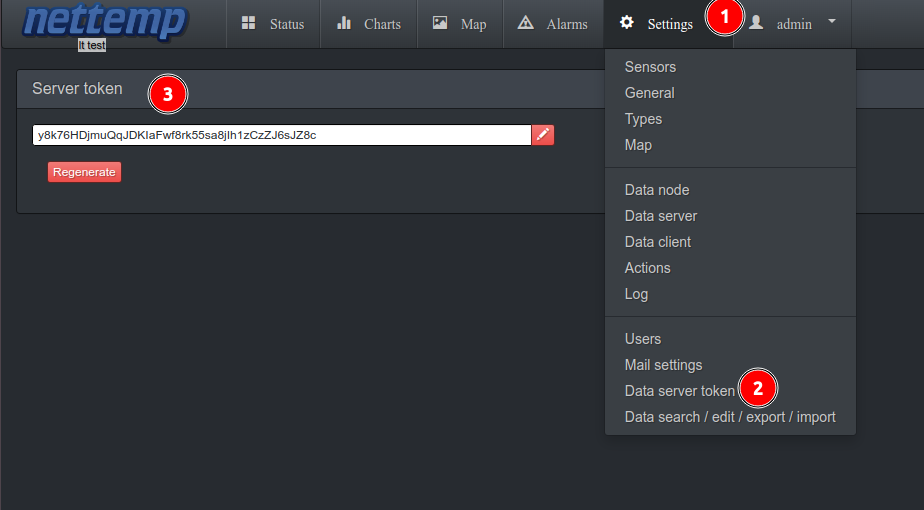
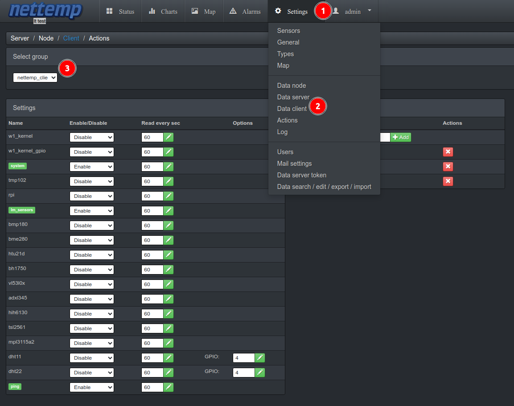

# General info

The Nettemp client is designed for Python 3 and utilizes a virtual environment. Ensure that I2C and 1-Wire are enabled on Raspberry Pi devices through the raspi-config tool.

Please note that drivers such as ds2482 may require root permissions. On Raspberry Pi, no additional action is needed, or on systems where the user has sudo privileges.


# Download and setup nettemp_client

```
git clone https://github.com/sosprz/nettemp_client
cd nettemp_client
bash ./setup.sh
```

# Set server IP and API key in config file.  

Go to nettemp and get token




```
nano config.conf
```

```

server_ip: 172.18.10.105
server_api_key: y8k76HDjmuQqJDKIaFwf8rk55sa8jIh1zCzZJ6sJZ8c
```


# Enable sensors via GUI




# Run app:

```
/home/pi/nettemp_client/venv/bin/python3 /home/pi/nettemp_client/nettemp_client.py
```

# Add to cron:

Script setup.sh will do this for You.

# Check if job is already in cron:

```
crontab -l
@reboot /bin/nohup /home/pi/nettemp_client/venv/bin/python3 /home/pi/nettemp_client/nettemp_client.py

```


