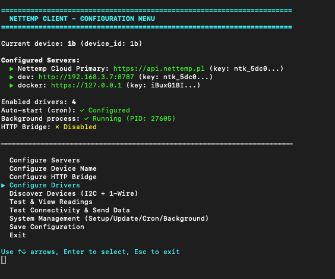
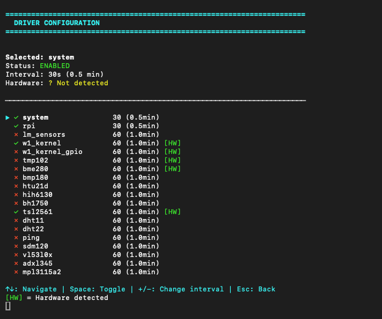
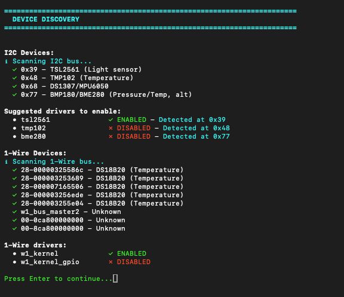
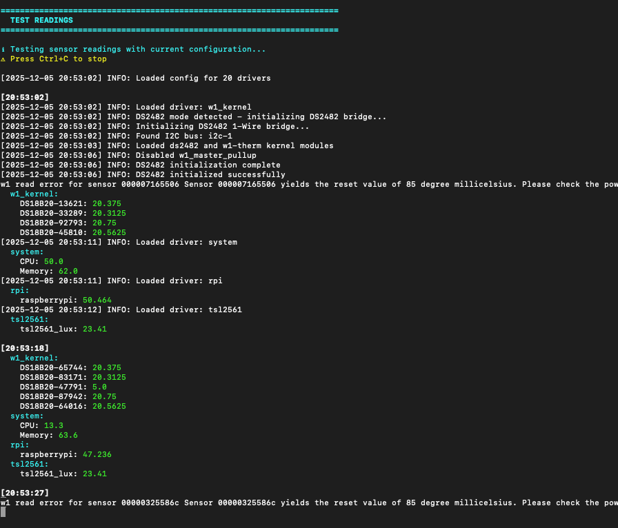
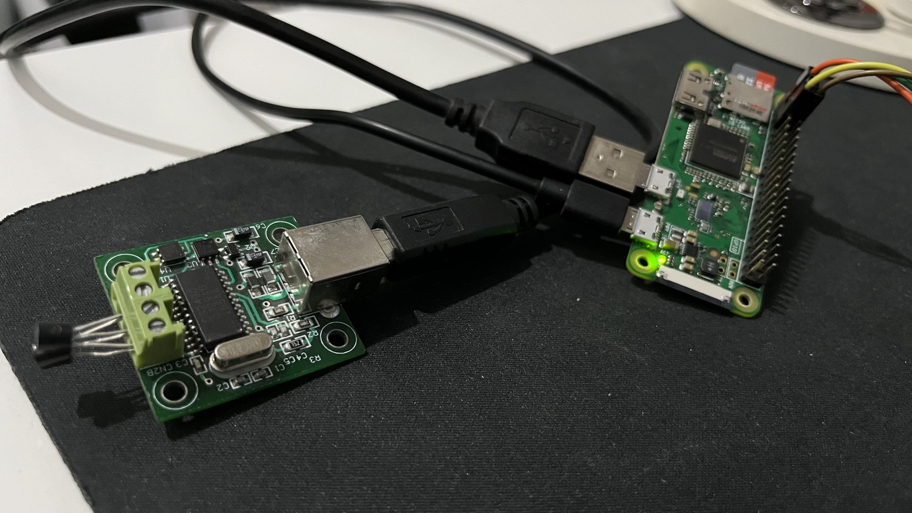
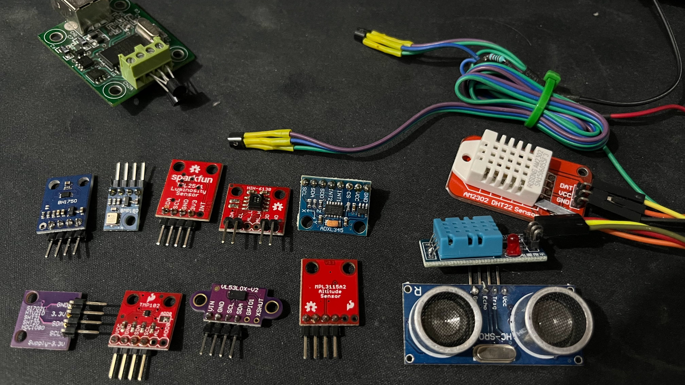

# Nettemp Client

**Universal IoT sensor data collector** for Raspberry Pi and other Linux devices. Reads from multiple sensor types (I2C, 1-Wire, GPIO, USB, Bluetooth, MQTT) with configurable intervals and sends data to **Nettemp Cloud** or **self-hosted Nettemp** instance.

**☁️ Cloud** - Managed hosting at [nettemp.pl](https://nettemp.pl) *(Available Now!)*  
**🐳 Docker** - Self-hosted with Docker Compose *(Available Now)*  
**🏠 Self-Hosted** - Deploy to your own server/VPS *(Available Now)*

## What is Nettemp Client?

Nettemp Client is a **multi-protocol sensor data aggregator** that:

- 📡 **Reads sensors** via I2C, 1-Wire, GPIO, USB (Modbus RTU), Bluetooth LE, and MQTT
- ⏱️ **Scheduled reading** with per-sensor configurable intervals (60s - 1 hour+)
- 🔄 **Interval-based forwarding** - Rate limiting for MQTT devices (prevents flooding)
- 📤 **Sends to cloud** - Nettemp Cloud, self-hosted, or multiple servers simultaneously
- 🔧 **Auto-discovery** - Detects I2C/1-Wire devices automatically
- 🎛️ **Interactive config** - Terminal UI with arrow key navigation
- 🚀 **Auto-start on boot** - Runs as background service via cron
- 📊 **System monitoring** - CPU, RAM, disk, temperature

### Multi-Protocol Support

**Direct Hardware Sensors:**
- 🔌 **I2C** - BME280, BMP180, TMP102, HTU21D, BH1750, TSL2561, ADXL345, VL53L0x, ADS1115 ADC
- 🌡️ **1-Wire** - DS18B20 (GPIO direct or DS2482 I2C bridge, DS9490R USB adapter)
- ⚡ **GPIO** - DHT11, DHT22, HC-SR04 ultrasonic
- 🔋 **USB Modbus RTU** - SDM120 power meter (RS485)

**Wireless & Network Sensors:**
- 📶 **Bluetooth LE (passive)** - Via **Theengs Gateway** subprocess for 70+ BLE devices (Xiaomi, Govee, etc.)
- 📡 **MQTT Subscriber** - Receive from MQTT broker with rule-based parsing:
  - **Theengs Gateway** - BLE sensors via MQTT (interval: 600s default)
  - **ESPEasy** - ESP8266/ESP32 firmware (interval: 300s)
  - **Tasmota** - Popular ESP firmware (interval: 300s)
  - **Zigbee2MQTT** - Zigbee devices (interval: 300s)
  - **Home Assistant** - MQTT discovery devices
  - **Shelly** - Smart home devices
  - **Generic JSON/Value** - Custom MQTT messages

**MQTT Bridge Modes:**
- 📤 **Publisher** - Send nettemp sensor readings to remote MQTT broker
- 📥 **Subscriber** - Receive MQTT messages and forward to cloud servers
- 🔄 **Both** - Bidirectional MQTT bridge

### Interval & Rate Limiting

**Hardware Sensors** (drivers_config.yaml):
- Per-driver interval configuration (default: 300s = 5 minutes)
- Example: `read_in_sec: 600` for 10-minute reads

**MQTT Sensors** (mqtt_rules.yaml):
- Per-rule interval-based forwarding (prevents flooding)
- Example intervals:
  - Theengs Gateway BLE: 600s (10 min) - battery-powered sensors
  - ESPEasy/Tasmota: 300s (5 min) - mains-powered ESP devices
  - Generic: 60s (1 min) - adjustable per use case
- Last forward time tracking per topic
- Receives all messages, forwards only after interval expires

**Configuration Interface:**
```
python3 nettemp_config.py
→ Configure Drivers (hardware sensors)
  → Arrow keys navigate, Space toggle, +/- adjust interval
→ Configure MQTT Bridge
  → r: Configure Sensor Rules (MQTT parsing & intervals)
    → Arrow keys navigate, Space toggle, i: edit interval
```

## Deployment Options

### ☁️ Nettemp Cloud - **nettemp.pl** *(Recommended)*
**Fully managed service** - Production ready and hosted on Cloudflare Workers.

- ✅ **Zero infrastructure** - No servers to maintain
- ✅ **Instant setup** - Get API key and start sending data
- ✅ **Global edge network** - Low latency worldwide
- ✅ **Automatic scaling** - Handles any number of devices
- ✅ **Web dashboard** - View and analyze sensor data
- ✅ **Free tier available** - Perfect for hobby projects

**Get started:** Visit [https://nettemp.pl](https://nettemp.pl), create account, copy your API key.

### 🏠 Self-Hosted *(Full Control)*
Run your own Nettemp server - available as Docker containers or manual deployment.

- ✅ **Complete control** - Your data, your infrastructure
- ✅ **Docker support** - One-command setup with `docker-compose up -d`
- ✅ **LAN-only option** - Works offline/isolated networks
- ✅ **Any platform** - Linux, Windows, cloud providers, Raspberry Pi
- ✅ **Custom domains** - Use your own URLs

**Repository:** [github.com/sosprz/nettemp](https://github.com/sosprz/nettemp) (includes Docker Compose setup)  
**Docker Hub:** [przemeksdocker/nettemp](https://hub.docker.com/r/przemeksdocker/nettemp)

---

**This client works with both options** - just configure the server URL and API key!

## Features

- ⚡ **22+ sensor drivers** - Temperature, humidity, light, motion, network, power
- 🔄 **Auto-discovery** - Automatically detects connected sensors
- ⏱️ **Scheduled reading** - Configurable intervals per sensor
- ☁️ **Cloud sync** - Real-time data to Nettemp Cloud
- 🔧 **Easy config** - YAML-based sensor configuration
- 🚀 **Auto-start** - Runs on boot via cron
- 🔌 **I2C/GPIO/1-Wire** - Full hardware support
- 📊 **System monitoring** - CPU, RAM, temperature

## Installation Options

### Option A: pipx (recommended)
Installs the CLI globally with an isolated venv.

```bash
sudo apt install -y build-essential gcc-aarch64-linux-gnu pipx python3-dev
pipx install "nettemp @ git+https://github.com/sosprz/nettemp_client.git"
pipx ensurepath
sudo su - ${USER}


# Run configurator / client
nettemp config
nettemp client
nettemp client restart
```

## Quick Install (one-shot interactive)

**On Raspberry Pi / Linux device:**

```bash
# 1. Clone repository
git clone https://github.com/sosprz/nettemp_client.git
cd nettemp_client

# 2. Run interactive configuration (auto-installs everything)
python3 nettemp_config.py
```

<div align="center">




</div>

That's it! The configuration tool will:
- ✅ Auto-install Python, venv, and system packages
- ✅ Create virtual environment
- ✅ Install Python dependencies
- ✅ Interactively configure servers and sensors
- ✅ Discover connected devices (I2C + 1-Wire)
- ✅ Test connectivity
- ✅ Setup auto-start on boot (cron)
- ✅ Start client in background

### Manual Configuration

If you prefer to edit config files directly:

```bash
# Copy example configs
cp example_config.conf config.conf
cp example_drivers_config.yaml drivers_config.yaml

# Edit configs
nano config.conf         # Set your server URL and API key
nano drivers_config.yaml # Enable sensors you have

# Run the client
python3 nettemp_client.py
```

## Available Drivers

<div align="center">


</div>

The client supports **22+ sensor drivers** with automatic hardware detection and configuration:

### System Monitoring
- `system` - CPU usage, RAM usage, disk space
- `rpi` - Raspberry Pi CPU temperature (reads from /sys/class/thermal)
- `lm_sensors` - Linux hardware monitoring (CPU, GPU, fans, voltages)

### Temperature & Humidity Sensors

**1-Wire (DS18B20):**
- `w1_kernel` - Kernel-based 1-Wire sensors
  - Direct GPIO connection (default)
  - **DS2482 I2C-to-1Wire bridge** support (set `ds2482: true`)
  - Auto-discovers all connected DS18B20 sensors
  - Supports **Dallas Semiconductor DS9490R USB 1-Wire adapter**
- `w1_kernel_gpio` - Simplified GPIO-only DS18B20 driver

**GPIO Sensors:**
- `dht11` - DHT11 temperature/humidity sensor (GPIO)
- `dht22` - DHT22/AM2302 temperature/humidity sensor (GPIO, higher accuracy)

**BLE Sensors:**
- `lywsd03mmc` - Xiaomi Mi Temperature Humidity Sensor 2 (Bluetooth Low Energy)
  - **Active connection mode** - Connects to sensors via Bluetooth LE
  - Reports temperature (±0.1°C) and humidity (±1% RH)
  - Supports **multiple sensors** via comma-separated MAC addresses
  - **Smart retry logic** - Automatic reconnection on failures
  - **Battery efficient** - Disconnects after each read cycle
  - **Connection stabilization** - 3-5 second delays for reliable reads
  - **Read retries** - Up to 3 attempts per characteristic read
  - Works with **stock Xiaomi firmware** (no custom firmware required)

**I2C Sensors:**
- `tmp102` - High-accuracy temperature sensor (±0.5°C)
- `bme280` - Temperature, humidity, pressure (Bosch)
- `bmp180` - Temperature, pressure (Bosch, legacy)
- `htu21d` - Temperature, humidity (±2% RH)
- `hih6130` - Temperature, humidity (Honeywell)
- `mpl3115a2` - Temperature, pressure, altitude

### Light Sensors (I2C)
- `bh1750` - Ambient light sensor (0.5-100,000 lux)
- `tsl2561` - Light sensor with IR detection

### Motion & Acceleration (I2C)
- `adxl345` - 3-axis accelerometer, ±16g
- `adxl343` - 3-axis accelerometer (lower power version)

### Distance Sensors
- `vl53l0x` - Laser distance sensor, 30-1000mm (I2C)
- `hcsr04` - Ultrasonic distance sensor, 2-400cm (GPIO via trigger/echo pins)

### Analog Sensors (requires ADS1115 ADC)
- `capacitive_soil` - Capacitive soil moisture sensor v1.2
  - Requires ADS1115 16-bit ADC (I2C)
  - Reports 0-100% moisture and raw voltage
  - Calibration support (voltage_dry, voltage_wet)

### Network & Utilities
- `ping` - Network latency monitoring (multiple hosts)

### Power Monitoring (Modbus RTU)
- `sdm120` - Eastron SDM120 Modbus power meter
  - Measures AC voltage, current, active power
  - Modbus RTU over RS485 serial interface
  - Configurable baudrate (9600, 19200, 38400)
  - Configurable parity (N=None, E=Even, O=Odd)
  - Requires USB-to-RS485 adapter (e.g., /dev/ttyUSB0)
  - Reports: voltage (V), current (A), power (W)

## Running

### Interactive Configuration & Management
```bash
python3 nettemp_config.py
```

Use the interactive menu to:
- Configure servers and sensors
- Discover connected devices
- Test connectivity
- Setup auto-start on boot (cron)
- Start/stop background client
- Update from GitHub

### Manual Start
```bash
source venv/bin/activate
python3 nettemp_client.py
```

### Auto-start on boot
Configured via `nettemp_config.py` → System Management → Setup Auto-Start.
Client runs automatically on boot via cron.

### Test Mode (fake data)
```bash
python3 demo_all_sensors.py
```

## Sending Data Manually (HTTP Bridge)

If you enable the optional `http_bridge` in `config.conf`, your Nettemp client exposes a lightweight HTTP endpoint (default: http://0.0.0.0:8080). You can POST data directly over HTTP and the client forwards it securely to Nettemp Cloud using the configured API key. This is handy for device firmwares that only speak HTTP.

### Enable HTTP Bridge

**Via Interactive Configuration (Recommended):**
```bash
python3 nettemp_config.py
# → Configure HTTP Bridge
# • Enable/Disable
# • Configure host and port
# • Set auth token
# • Select Destination Servers (send to all or specific servers)
```

The configuration tool allows you to:
- ✅ **Select specific servers** - Choose which Nettemp servers receive HTTP bridge data
- ✅ **Send to all servers** - Leave empty to forward to all enabled servers (default)
- ✅ **Test configuration** - Validate settings before saving

**Manual Configuration** (`config.conf`):
```yaml
http_bridge:
  enabled: true
  host: 0.0.0.0
  port: 8080
  auth_token: local_shared_secret   # optional but recommended
  servers:                           # optional: specific servers only
    - Server1
    - Server2
    # Empty or omitted = send to all enabled servers
```

### 1. Cloud Payload (Device + readings)

```bash
curl -X POST http://your-client:8080/ \
  -H "Content-Type: application/json" \
  -H "Authorization: Bearer local_shared_secret" \
  -d '{
        "device_id": "living-room-1",
        "readings": [
          {
            "sensor_id": "1b-28_000007165506",
            "sensor_type": "temperature",
            "value": 21.75,
            "unit": "°C",
            "timestamp": 1732036297,
            "metadata": {
              "name": "Living Room Temp",
              "original_rom": "28-000007165506"
            }
          }
        ]
      }'
```

Python example:

```python
import requests, time

payload = {
    "device_id": "living-room-1",
    "readings": [
        {
            "sensor_id": "1b-28_000007165506",
            "sensor_type": "temperature",
            "value": 21.75,
            "unit": "°C",
            "timestamp": int(time.time())
        }
    ]
}

resp = requests.post(
    "http://your-client:8080/",
    json=payload,
    headers={"Authorization": "Bearer local_shared_secret"}
)
resp.raise_for_status()
```

### 2. Legacy Payload (list of ROM/value objects)

```bash
curl -X POST http://your-client:8080/ \
  -H "Content-Type: application/json" \
  -d '[{"rom":"28-000007165506","type":"temperature","value":21.75,"unit":"°C","name":"Living Room"}]'
```

In Python:

```python
legacy = [
    {"rom":"28-000007165506","type":"temperature","value":21.75,"unit":"°C","name":"Living Room"}
]

requests.post("http://your-client:8080/", json=legacy)
```

The client forwards legacy payloads via `insert2` (local server + cloud), and forwards the new cloud format directly to your configured cloud servers.

### 3. ESP Easy "Generic HTTP" (GET)

Point ESP Easy’s `Generic HTTP` controller at the bridge URL:

```
http://your-client:8080/generic_http?name=%sysname%&task=%tskname%&valuename=%valname%&value=%value%
```

You can test it manually:

```bash
curl "http://your-client:8080/generic_http?name=esp1&task=dht22&valuename=temperature&value=23.4&unit=%25"
```

The bridge converts that into the legacy format and forwards it just like a local driver reading.

## MQTT Bridge

The Nettemp client includes a powerful **MQTT Bridge** that enables bidirectional integration with MQTT brokers. This allows you to:

- **Publish sensor data** to MQTT topics (Publisher mode) - **All driver readings are automatically published**
- **Receive MQTT messages** and forward them to Nettemp Cloud (Subscriber mode)
- **Both modes simultaneously** for full IoT ecosystem integration

**Configure via Interactive Tool:**
```bash
python3 nettemp_config.py
# → Configure MQTT Bridge
# • Enable/Disable
# • Set mode (publisher/subscriber/both)
# • Configure broker, port, authentication
# • Publisher settings (topic prefix, QoS, retain)
# • Subscriber settings (topics, auth token)
# • Select Destination Servers (for subscriber mode)
# • Test Connection
```

### Enable MQTT Bridge

Configure via `nettemp_config.py` → Configure MQTT Bridge, or edit `config.conf`:

```yaml
mqtt:
  enabled: true
  mode: both              # publisher, subscriber, or both
  broker: mqtt.example.com
  port: 1883
  username: user          # optional
  password: pass          # optional
  tls: false              # enable TLS/SSL (port 8883)
  
  # Publisher settings (Sensors → MQTT)
  topic_prefix: nettemp
  qos: 0                  # 0, 1, or 2
  retain: false
  
  # Subscriber settings (MQTT → Cloud)
  subscribe_topics:
    - sensors/#
    - home/+/temperature
  auth_token: shared_secret  # optional validation
  servers:                   # optional: specific servers for MQTT data
    - Server1
    - Server2
```

### Architecture Diagram

```
┌─────────────────────────────────────────────────────────────────┐
│                     MQTT Bridge Architecture                     │
└─────────────────────────────────────────────────────────────────┘

PUBLISHER MODE (Sensors → MQTT):
┌──────────────┐    ┌──────────────┐    ┌──────────────┐
│   DS18B20    │───▶│              │───▶│     MQTT     │
│   BME280     │    │   Nettemp    │    │    Broker    │
│   DHT22      │───▶│    Client    │───▶│ (Mosquitto)  │
│   System     │    │ (Publisher)  │    │              │
└──────────────┘    └──────────────┘    └──────────────┘
                                              │
                                              ▼
                    Topics: nettemp/{device_id}/{sensor_id}/{type}
                    Payload: {"value": 21.5, "timestamp": 1234567890}

SUBSCRIBER MODE (MQTT → Cloud/Docker):
┌──────────────┐    ┌──────────────┐    ┌──────────────┐
│   ESP8266    │───▶│     MQTT     │───▶│   Nettemp    │
│   Arduino    │    │    Broker    │    │    Client    │
│   Tasmota    │───▶│ (Mosquitto)  │───▶│ (Subscriber) │
│   Zigbee2M   │    │              │    │              │
└──────────────┘    └──────────────┘    └──────────────┘
                                              │
                                              ▼
                                        ┌──────────────┐
                                        │ Nettemp Cloud│
                                        │  (nettemp.pl)│
                                        │      or      │
                                        │Self-Hosted   │
                                        │   (Docker)   │
                                        └──────────────┘

BOTH MODES (Full IoT Ecosystem):
┌──────────────┐                    ┌──────────────┐
│  All Sensors │───▶ MQTT Broker ◀──│ All IoT      │
│  (Drivers)   │         │          │  Devices     │
└──────────────┘         │          └──────────────┘
                         ▼
              ┌──────────────────────┐
              │ Home Automation       │
              │ (Home Assistant, etc) │
              └──────────────────────┘
                         ▼
              ┌──────────────────────┐
              │ Nettemp Cloud/Docker │
              │ (filtered servers)   │
              └──────────────────────┘
```

**Supported Backends:**
- ☁️ **Nettemp Cloud** - Managed hosting at [nettemp.pl](https://nettemp.pl)
- 🐳 **Docker Self-Hosted** - Run your own instance with Docker Compose
- 🏠 **Manual Self-Hosted** - Deploy to any Linux server/VPS

### Publisher Mode (Sensors → MQTT)

When enabled, the client publishes all sensor readings to MQTT topics.

**Topic Structure:**
```
{topic_prefix}/{device_id}/{sensor_id}/{type}

Examples:
  nettemp/raspberry-pi-1/28-000007165506/temperature
  nettemp/office-sensor/bme280_0x76/humidity
  nettemp/living-room/system/cpu_usage
```

**Message Payload (JSON):**
```json
{
  "value": 21.75,
  "type": "temperature",
  "sensor_id": "28-000007165506",
  "timestamp": 1732036297,
  "unit": "°C",
  "name": "Living Room Temp"
}
```

**Use Cases:**
- Home Assistant integration
- Node-RED dashboards
- Grafana/InfluxDB monitoring
- MQTT-based automation
- Multi-site data aggregation

### Subscriber Mode (MQTT → Cloud)

The client subscribes to MQTT topics and forwards received messages to Nettemp Cloud.

**Supported Message Formats:**

#### 1. JSON Array (Nettemp native format)
```json
[
  {
    "rom": "esp8266_sensor1",
    "type": "temperature",
    "value": 23.5,
    "unit": "°C",
    "name": "ESP8266 Temp"
  }
]
```

#### 2. JSON Object (Single Reading)
```json
{
  "sensor_id": "esp01",
  "type": "temperature",
  "value": 22.1,
  "unit": "°C"
}
```

#### 3. Cloud Format (Device + Readings)
```json
{
  "device_id": "mqtt-device-1",
  "readings": [
    {
      "sensor_id": "sensor1",
      "sensor_type": "temperature",
      "value": 21.5,
      "timestamp": 1732036297
    }
  ]
}
```

#### 4. Simple Value (Non-JSON)
```
Topic: home/living/temperature
Payload: 21.5
```
Auto-parsed: sensor_id from topic, value from payload.

**Server Filtering:**

Configure which Nettemp servers receive MQTT data (similar to HTTP Bridge):

```yaml
mqtt:
  servers:
    - Server1      # Only forward to specific servers
    - Server2
    # Empty or omitted = forward to all enabled servers
```

Configure via: `nettemp_config.py` → Configure MQTT Bridge → Select Destination Servers

**Authentication:**

Optional token validation for incoming MQTT messages:

```yaml
mqtt:
  auth_token: shared_secret
```

Messages must include token:
```json
{
  "auth_token": "shared_secret",
  "sensor_id": "sensor1",
  "value": 22.5
}
```

### MQTT Message Parsing (mqtt_rules.yaml)

The MQTT subscriber uses a rule-based parser configured in `mqtt_rules.yaml`. Rules define how to parse messages from different IoT devices:

**Supported Device Types:**
- Theengs Gateway (BLE sensors: Xiaomi)
- ESPEasy
- Generic JSON
- Simple values

**Rule Configuration:**
```yaml
rules:
  - name: "Theengs Gateway"
    topic_pattern: "home/TheengsGateway/BTtoMQTT"
    format: json
    device_id_field: "name"          # MAC address or device name
    sensor_name_field: "type"        # Sensor type (temperature, humidity)
    readings_map:
      tem: temperature               # Map JSON field to sensor type
      hum: humidity
      batt: battery
    interval: 600                    # Rate limiting (seconds)
    allowed_devices:                 # Whitelist (optional)
      - "A4:C1:38:12:34:56"
    autodiscover: false              # Enable device discovery logging
```

**Interactive Device Discovery:**
Use `nettemp_config.py` → Configure MQTT Bridge → Autodiscover MQTT Devices to scan for devices and select which ones to whitelist.

**Global Exclusions:**
```yaml
exclude_topics:
  - "nettemp/#"                      # Don't loop back own messages
  - "*/LWT"                          # Ignore Last Will Testament
  - "homeassistant/*/config"         # Skip HA discovery
```

Configure via: `mqtt_rules.yaml` in the client directory.

### BLE to MQTT Bridge (Theengs Gateway)

**Automatically integrate Bluetooth Low Energy sensors** via Theengs Gateway, managed as a subprocess by nettemp_client.

**Features:**
- 🔵 Supports BLE devices (Xiaomi)
- 🔄 Auto-starts/stops with nettemp_client
- 📋 Interactive device discovery and whitelist selection
- ⏱️ Rate limiting per device (configurable intervals)
- 🎯 Device filtering via mqtt_rules.yaml
- 🔧 Configuration via interactive menu

**Quick Setup:**
```bash
# Configure via menu
python3 nettemp_config.py
# → Configure Theengs Gateway (BLE to MQTT)
# → Enable, set MQTT broker, Bluetooth adapter
# → Save and restart nettemp_client
```

**Configuration:**
```yaml
theengs_gateway:
  enabled: true
  mqtt_host: 127.0.0.1
  mqtt_port: 1883
  adapter: hci0                      # Bluetooth adapter
  ble_scan_time: 10                  # Scan duration (seconds)
  ble_time_between_scans: 30         # Wait between scans (seconds)
  scanning_mode: passive             # passive or active
  publish_topic: home/TheengsGateway/BTtoMQTT
```

**Device Discovery & Filtering:**
```bash
python3 nettemp_config.py
# → Configure MQTT Bridge → Autodiscover MQTT Devices
# → Scans for BLE devices publishing to MQTT
# → Select devices with arrow keys and space bar
# → Automatically updates whitelist in mqtt_rules.yaml
```

**Supported Devices:** See [Theengs Decoder compatibility list](https://decoder.theengs.io/devices/devices.html)

**Flow:** BLE Sensors → Theengs Gateway → MQTT Broker → Nettemp Parser (mqtt_rules.yaml) → Nettemp Cloud

### Example Configurations

#### Home Assistant Integration

**Nettemp Client (Publisher):**
```yaml
mqtt:
  enabled: true
  mode: publisher
  broker: homeassistant.local
  port: 1883
  username: mqtt_user
  password: mqtt_pass
  topic_prefix: nettemp
  qos: 1
  retain: true
```

**Home Assistant `configuration.yaml`:**
```yaml
sensor:
  - platform: mqtt
    name: "Living Room Temperature"
    state_topic: "nettemp/raspberry-pi-1/28-000007165506/temperature"
    unit_of_measurement: "°C"
    value_template: "{{ value_json.value }}"
```

#### ESPEasy → MQTT → Nettemp Cloud

**ESPEasy Configuration:**

ESPEasy devices can send data directly to MQTT broker using the built-in **Home Assistant (openHAB) MQTT** protocol.

1. In ESPEasy web interface, go to **Controllers**
2. Add controller → Select **Home Assistant (openHAB) MQTT**
3. Configure:
   - **Controller IP**: Your MQTT broker IP (e.g., `192.168.1.100`)
   - **Controller Port**: `1883`
   - **Controller User/Password**: Your MQTT credentials (if required)

ESPEasy will automatically publish sensor data in format:
```
Topic: ESPEasyMega_1/system/rssi
Payload: -57

Topic: ESPEasyMega_1/system/ram
Payload: 20080
```

**Nettemp Client (Subscriber):**
```yaml
mqtt:
  enabled: true
  mode: subscriber
  broker: 192.168.1.100  # Your MQTT broker
  port: 1883
  subscribe_topics:
    - '#'                 # Subscribe to all topics
  exclude_topics:
    - nettemp/#          # Exclude own published data (prevents loops)
  servers:
    - ProductionServer   # Forward to specific server(s)
```

The Nettemp client will automatically:
- Parse ESPEasy format: `device/task/valuename value`
- Create sensor ID: `ESPEasyMega_1_system_rssi`
- Generate friendly name: "System Rssi"
- Forward to both Docker (legacy) and Cloud (new format)

**Supported ESPEasy Data:**
- System stats (RSSI, RAM, uptime)
- Temperature sensors (DS18B20, DHT, BME280)
- Custom sensors and switches
- Any task/value combination

#### ESP8266 → MQTT → Nettemp Cloud (Arduino)

**ESP8266 (Arduino/PlatformIO):**
```cpp
#include <PubSubClient.h>

const char* mqtt_server = "mqtt.example.com";
const char* topic = "sensors/esp01/temperature";

void loop() {
  float temp = readTemperature();
  
  String payload = "{\"sensor_id\":\"esp01\",\"type\":\"temperature\",\"value\":";
  payload += String(temp);
  payload += "}";
  
  client.publish(topic, payload.c_str());
  delay(60000);
}
```

**Nettemp Client (Subscriber):**
```yaml
mqtt:
  enabled: true
  mode: subscriber
  broker: mqtt.example.com
  port: 1883
  subscribe_topics:
    - sensors/#
  servers:
    - ProductionServer  # Forward only to specific server
```

#### Zigbee2MQTT Integration

Forward Zigbee sensor data to Nettemp Cloud:

```yaml
mqtt:
  enabled: true
  mode: subscriber
  broker: localhost
  port: 1883
  subscribe_topics:
    - zigbee2mqtt/+/temperature
    - zigbee2mqtt/+/humidity
```

Zigbee2MQTT publishes:
```
Topic: zigbee2mqtt/0x00158d00045a1234/temperature
Payload: 22.5
```

Nettemp client auto-converts to sensor reading.

### MQTT Parsing Rules & Intervals

Nettemp Client uses **rule-based parsing** (`mqtt_rules.yaml`) to handle different MQTT message formats. Each rule defines:
- 📝 **Topic pattern** - Which topics to match (supports wildcards)
- 🔧 **Parser format** - JSON, simple value, or custom extraction
- ⏱️ **Forward interval** - Rate limiting to prevent flooding
- 🎯 **Field mapping** - Extract device ID, sensor type, readings

**Configuration:**
```bash
python3 nettemp_config.py
# → Configure MQTT Bridge → r: Configure Sensor Rules
```

**Example Rules (mqtt_rules.yaml):**

```yaml
rules:
  # Theengs Gateway - BLE sensors via MQTT
  - name: "Theengs Gateway"
    enabled: true
    topic_pattern: "*/TheengsGateway/BTtoMQTT/*"
    format: json
    interval: 600  # 10 minutes (battery-powered BLE sensors)
    device_id_field: "name"
    sensor_name_field: "type"
    readings_map:
      tempc: {type: "temperature", unit: "°C"}
      hum: {type: "humidity", unit: "%"}
      batt: {type: "battery", unit: "%"}

  # ESPEasy - ESP8266/ESP32 firmware
  - name: "ESPEasy"
    enabled: true
    topic_pattern: "*/*/*"  # device/task/valuename
    format: value
    interval: 300  # 5 minutes (mains-powered)
    device_id_from: topic  # Extract from topic[0]
    sensor_id_format: "{device}_{task}_{valuename}"
    value_type_from: valuename

  # Tasmota - JSON sensor data
  - name: "Tasmota Sensor"
    enabled: true
    topic_pattern: "tele/*/SENSOR"
    format: json
    interval: 300  # 5 minutes
    device_id_from: topic
    flatten_nested: true  # Convert nested JSON to flat
    readings_map:
      Temperature: {type: "temperature", unit_from_field: "TempUnit"}
      Humidity: {type: "humidity", unit: "%"}

  # Generic JSON - Custom devices
  - name: "Generic JSON"
    enabled: true
    topic_pattern: "*"
    format: json
    interval: 60  # 1 minute (adjustable)
    device_id_field: "device_id"
    readings_map:
      value: {type_from_field: "type", unit_from_field: "unit"}
```

**How Intervals Work:**
- 📥 MQTT bridge **receives all messages** immediately
- ⏱️ Tracks **last forward time** per topic
- 🚦 Forwards to cloud **only after interval expires**
- 🔇 Silently drops messages within interval (prevents flooding)

**Example:**
```
Theengs Gateway BLE sensor sends every 60s
→ Rule interval: 600s (10 minutes)
→ Forwards at: 0:00, 0:10, 0:20, 0:30...
→ Drops messages at: 0:01, 0:02, ..., 0:09, 0:11, ...
```

**Use Cases:**
- ⚡ Fast devices (1s): Set interval to 60s to forward once per minute
- 🔋 Battery sensors: Set interval to 600s+ to reduce cloud writes
- 💾 Storage optimization: Higher intervals = less database writes
- 📊 Real-time critical: Set interval to 60s for frequent updates

**Device Filtering:**
- Subscribe to specific devices via `config.conf` → `subscribe_topics`
- Use autodiscovery to select devices interactively
- MQTT broker filters messages before nettemp client receives them
- Parsing rules process only subscribed messages

**Interactive Configuration:**
```
python3 nettemp_config.py → Configure MQTT Bridge → r: Configure Sensor Rules

▶ ✓ Theengs Gateway           600s (10.0min)
  ✓ ESPEasy                    300s (5.0min)
  ✓ Tasmota Sensor             300s (5.0min)
  ✗ Zigbee2MQTT                300s (5.0min)

↑↓: Navigate | Space: Toggle | +/-: Interval | i: Edit | Esc: Save & Back
```

### Testing MQTT Connection

**Via Configuration Menu:**
```bash
python3 nettemp_config.py
# → Configure MQTT Bridge → Test Connection
```

**Manual Test (Mosquitto clients):**
```bash
# Subscribe to published sensor data
mosquitto_sub -h mqtt.example.com -t "nettemp/#" -v

# Publish test message
mosquitto_pub -h mqtt.example.com -t "sensors/test/temperature" \
  -m '{"sensor_id":"test","type":"temperature","value":21.5}'
```

### Installing Mosquitto Broker

**Automatic Installation (Recommended):**
```bash
python3 nettemp_config.py
# → System Management → Environment Setup
```

The configuration tool automatically:
- ✅ **Detects** if Mosquitto is installed
- ✅ **Offers to install** Mosquitto broker and clients if missing
- ✅ **Configures** system packages and dependencies
- ✅ **Enables** and starts the Mosquitto service

**Manual installation (if needed):**
```bash
sudo apt-get update
sudo apt-get install -y mosquitto mosquitto-clients

# Enable and start
sudo systemctl enable mosquitto
sudo systemctl start mosquitto

# Check status
sudo systemctl status mosquitto
```

**Basic Mosquitto config** (`/etc/mosquitto/mosquitto.conf`):
```
listener 1883
allow_anonymous true
```

For production, enable authentication:
```bash
# Create password file
sudo mosquitto_passwd -c /etc/mosquitto/passwd mqtt_user

# Update config
listener 1883
allow_anonymous false
password_file /etc/mosquitto/passwd

# Restart
sudo systemctl restart mosquitto
```

### MQTT Bridge Features

✅ **Dual Mode** - Publish sensor data AND receive MQTT messages  
✅ **Auto-Reconnect** - Maintains connection with automatic retry  
✅ **TLS/SSL Support** - Secure MQTT connections (port 8883)  
✅ **QoS Levels** - Configurable message delivery guarantees (0, 1, 2)  
✅ **Authentication** - Username/password + optional token validation  
✅ **Multiple Topics** - Subscribe to multiple topic patterns (wildcards supported)  
✅ **Server Filtering** - Route MQTT data to specific Nettemp servers  
✅ **Message Formats** - Supports JSON, simple values, and Nettemp native format  
✅ **Connection Testing** - Built-in broker connectivity validation  

### Troubleshooting MQTT

**Connection refused:**
```bash
# Check if Mosquitto is running
sudo systemctl status mosquitto

# Test connection
mosquitto_pub -h localhost -t test -m "hello"

# Check firewall (if remote broker)
sudo ufw allow 1883/tcp
```

**No messages received:**
```bash
# Verify subscription topics
mosquitto_sub -h localhost -t "#" -v

# Check MQTT logs
sudo journalctl -u mosquitto -f

# Enable debug in config.conf
log_level: DEBUG
```

**Authentication failed:**
```bash
# Test with credentials
mosquitto_pub -h mqtt.example.com -u user -P pass -t test -m "hello"

# Verify username/password in config.conf
```

**TLS/SSL errors:**
```bash
# Test TLS connection
mosquitto_pub -h mqtt.example.com -p 8883 \
  --cafile /etc/ssl/certs/ca-certificates.crt \
  -t test -m "hello"
```

For detailed MQTT setup guide, see: `doc/MQTT_SETUP.md`

## Updating

### Quick Update (Recommended)

```bash
cd nettemp_client
python3 nettemp_config.py
# Select: System Management → Update from GitHub
```

The interactive update tool automatically:
- ✅ Stops the running client
- ✅ Pulls latest changes from GitHub
- ✅ Updates Python dependencies
- ✅ Preserves your configurations
- ✅ Offers to restart the client

### Manual Update

```bash
# Navigate to installation directory
cd nettemp_client

# Pull latest changes
git pull origin main

# Update Python dependencies
source venv/bin/activate
pip3 install -r requirements.txt --upgrade

# Restart the client
python3 nettemp_client.py
```

**Your configurations are safe:**
- `config.conf` - Your device settings are preserved
- `drivers_config.yaml` - Your sensor configurations are preserved

The update only modifies:
- Code files (*.py)
- Example templates (`example_config.conf`, `example_drivers_config.yaml`)
- Documentation
- Default driver files

**Note:** If new configuration options are added, check `example_config.conf` or `example_drivers_config.yaml` for reference.

## Hardware Setup

### I2C Sensors
```bash
# Enable I2C
sudo raspi-config
# Interface Options → I2C → Enable

# Check I2C devices
i2cdetect -y 1
```

### GPIO Sensors (DHT22, DHT11)
Connect to GPIO pins as configured in `drivers_config.yaml`.

### BLE Sensors (Xiaomi LYWSD03MMC)

The `lywsd03mmc` driver supports Xiaomi Mi Temperature Humidity Sensor 2 via Bluetooth Low Energy.

**Hardware Requirements:**
- Raspberry Pi with Bluetooth (Pi 3, 4, Zero W, or USB BLE dongle)
- Xiaomi LYWSD03MMC sensor (CR2032 battery powered)

**Automatic Setup (Recommended):**
```bash
python3 nettemp_config.py
# → System Management → Environment Setup
# → Configure Drivers → Enable lywsd03mmc
```

The configuration tool automatically:
- ✅ **Installs** all required BLE Python packages from `requirements.txt`
- ✅ **Checks** for missing dependencies
- ✅ **Configures** BLE sensor settings interactively
- ✅ **Tests** sensor connectivity before saving

**Manual Dependencies (if needed):**
```bash
# Install BLE libraries
pip3 install adafruit-circuitpython-ble
pip3 install adafruit-circuitpython-ble-lywsd03mmc
```

**Configuration:**
```yaml
# In drivers_config.yaml:
lywsd03mmc:
  enabled: true
  read_in_sec: 300
  device_name: "LYWSD03MMC"  # BLE device name
  mac_address: null          # Optional: MAC address for specific sensor
  sensor_id: "default"       # Unique ID for multiple sensors
```

**Multiple Sensors:**
To use multiple LYWSD03MMC sensors, create separate entries with different IDs:
```yaml
lywsd03mmc_living:
  enabled: true
  read_in_sec: 300
  device_name: "LYWSD03MMC"
  mac_address: "A4:C1:38:XX:XX:XX"
  sensor_id: "living_room"

lywsd03mmc_bedroom:
  enabled: true
  read_in_sec: 300
  device_name: "LYWSD03MMC"
  mac_address: "A4:C1:38:YY:YY:YY"
  sensor_id: "bedroom"
```

**Finding MAC Address:**
```bash
# Scan for BLE devices
sudo hcitool lescan
# Look for "LYWSD03MMC" and note the MAC address
```

**Troubleshooting:**
- Ensure Bluetooth is enabled: `sudo systemctl status bluetooth`
- Check BLE scan: `sudo hcitool lescan`
- Run client with sudo for BLE access: `sudo python3 nettemp.py`
- Keep sensor within 10m range
- Replace battery if readings fail intermittently

### Modbus RTU Sensors (SDM120)

The SDM120 power meter uses Modbus RTU over RS485 serial interface.

**Hardware Setup:**
```bash
# Connect USB-to-RS485 adapter to Raspberry Pi
# Check device appears as /dev/ttyUSB0 (or /dev/ttyAMA0)
ls -la /dev/tty*

# Add user to dialout group for serial access
sudo usermod -a -G dialout $USER
sudo reboot
```

**Configuration:**
```yaml
# In drivers_config.yaml:
sdm120:
  enabled: true
  read_in_sec: 60
  port: /dev/ttyUSB0  # Serial port
  unit: 1              # Modbus unit ID (check meter display/settings)
  baudrate: 9600       # Common: 9600, 19200, 38400
  parity: "N"          # N=None, E=Even, O=Odd
```

**Dependencies:**
```bash
# Install Modbus libraries
pip install pymodbus==2.5.3 sdm-modbus==0.5.0
```

**Troubleshooting:**
- Verify serial port permissions: `sudo chmod 666 /dev/ttyUSB0`
- Check Modbus unit ID on meter (default is often 1 or 2)
- Verify baudrate matches meter settings
- Check RS485 wiring (A/B polarity, termination resistor)
- Test connection: Check logs for "No response from meter" errors

### 1-Wire (DS18B20 Temperature Sensors)

The `w1_kernel` driver supports multiple connection methods:

**Option 1: Direct GPIO Connection**
```bash
# Enable 1-wire via raspi-config
sudo raspi-config
# Interface Options → 1-Wire → Enable

# Or manually add to /boot/config.txt:
dtoverlay=w1-gpio,gpiopin=4  # Default GPIO 4

# Reboot to apply
sudo reboot

# Check for sensors
ls /sys/bus/w1/devices/
# Example: 28-000007165506
```

**Option 2: DS2482 I2C-to-1Wire Bridge (for many sensors)**
```yaml
# In drivers_config.yaml:
w1_kernel:
  enabled: true
  read_in_sec: 60
  ds2482: true  # Enables DS2482 initialization at startup
```

The DS2482 bridge (I2C address 0x18) allows connecting **many 1-Wire sensors** over a single I2C bus:
- Supports up to 8 channels (DS2482-800)
- Long cable runs (100+ meters)
- Better noise immunity than GPIO
- Hardware is initialized automatically on startup
- Compatible with Nettemp Pi HAT and generic DS2482 breakout boards

**Option 3: Dallas Semiconductor DS9490R USB 1-Wire Adapter**

The DS9490R is a USB-to-1Wire adapter that appears as a kernel 1-wire master:

```bash
# Install kernel module (usually pre-installed)
sudo modprobe ds2490

# Connect DS9490R USB adapter
# Sensors will appear in /sys/bus/w1/devices/

# Enable in config:
w1_kernel:
  enabled: true
  read_in_sec: 60
  # No ds2482 flag needed - kernel handles USB adapter automatically
```

The USB adapter is ideal for:
- Systems without GPIO (x86, laptops, servers)
- Galvanically isolated 1-Wire networks
- Hot-pluggable sensor networks
- Testing without Raspberry Pi

All three methods auto-discover connected DS18B20 sensors and create separate sensor readings for each device.

Note about the Nettemp Pi HAT / DS2482 addon
-------------------------------------------
There was a Nettemp Pi HAT (DS2482-based 1-Wire bridge) sold previously via Kamami. The product page (now withdrawn) is available for historical reference:

https://kamami.pl/wycofane-z-oferty/559377-nettemp-pi-hat-modul-nettemp-dla-komputera-raspberry-pi.html

This specific HAT appears to be discontinued from that supplier. If you need the same functionality today, you can use any compatible DS2482 I2C-to-1-Wire bridge breakout (for example modules labeled DS2482-800) or run multiple DS18B20 sensors directly on the Pi\'s 1-Wire GPIO (if wiring allows).

To enable DS2482 support in this client, set `ds2482: true` under `w1_kernel` in `drivers_config.yaml` (example above). The driver will attempt to initialize the DS2482 bridge on startup.

## Troubleshooting

**No sensors found:**
- Check hardware connections
- Verify I2C enabled: `i2cdetect -y 1`
- Check GPIO pins match config
-- Install sensor libraries: `pip install -r requirements.txt`

**Cannot connect to server:**
- Check `cloud_server` URL (cloud or self-hosted)
- Verify `cloud_api_key` is valid
- Test connection:
  - Cloud: `curl https://your-worker.workers.dev`
  - Self-hosted: `curl http://your-server:8787`

**Data not showing in dashboard:**
- Check `cloud_enabled: true`
- Verify device name (`group`) is correct
- Check logs: `python3 nettemp_client.py`

**Permission denied (I2C):**
```bash
sudo usermod $USER -aG i2c
sudo reboot
```

## Adding Custom Drivers

Create `drivers/my_sensor.py`:

```python
def my_sensor(config_dict):
    """
    My custom sensor
    Config: {"enabled": true, "read_in_sec": 60, ...}
    """
    value = read_hardware()

    return [
        {
            "rom": "_my_sensor",
            "type": "temperature",
            "value": value,
            "name": "My Sensor"
        }
    ]
```

Add to `drivers_config.yaml`:
```yaml
my_sensor:
  enabled: true
  read_in_sec: 60
```

## Uninstall

```bash
# Remove cron job
crontab -l | grep -v nettemp_client | crontab -

# Remove files
rm -rf /path/to/nettemp_cloud/client
```

## Community & Resources

**Discord Server** - Get help, share projects, and discuss development:  
https://discord.gg/S4egxNvQHM

**Main Repository** - Backend, Docker setup, and documentation:  
https://github.com/sosprz/nettemp

**Docker Hub** - Pre-built container images:  
https://hub.docker.com/r/przemeksdocker/nettemp

## Support

See main repository for backend deployment and dashboard documentation.

## API Usage Examples

The API host for client devices is `https://api.nettemp.pl`. Below are simple examples for sending sensor data.

### cURL (POST bulk data)

Use a heredoc with `-d @-` to keep the payload readable and avoid escaping:

```bash
curl -X POST "https://api.nettemp.pl/api/v1/data" \
  -H 'Content-Type: application/json' \
  -H 'Authorization: Bearer ntk_YOUR_API_KEY' \
  -d @- <<'JSON'
{
  "device_id": "device-1",
  "readings": [
    {"sensor_id": "s1", "type": "temperature", "value": 22.4},
    {"sensor_id": "s2", "type": "humidity", "value": 55.1}
  ]
}
JSON
```

**Note:** The server enforces a maximum of 100 unique sensors per request. If you have more sensors, split them into batches of <= 100 readings per request.

### Python (requests)

```python
import requests

url = "https://api.nettemp.pl/api/v1/data"
headers = { 'Authorization': 'Bearer ntk_YOUR_API_KEY', 'Content-Type': 'application/json' }
payload = {
  "device_id": "device-1",
  "readings": [
    {"sensor_id": "s1", "type": "temperature", "value": 22.4},
    {"sensor_id": "s2", "type": "humidity", "value": 55.1}
  ]
}
resp = requests.post(url, json=payload, headers=headers)
print(resp.status_code, resp.text)
```

### JavaScript (fetch)

```javascript
const url = 'https://api.nettemp.pl/api/v1/data';
const payload = {
  device_id: 'device-1',
  readings: [
    { sensor_id: 's1', type: 'temperature', value: 22.4 },
    { sensor_id: 's2', type: 'humidity', value: 55.1 }
  ]
};

fetch(url, {
  method: 'POST',
  headers: {
    'Content-Type': 'application/json',
    'Authorization': 'Bearer ntk_YOUR_API_KEY'
  },
  body: JSON.stringify(payload)
}).then(r => r.json()).then(console.log).catch(console.error);
```

For large sensor sets, chunk readings into batches of at most 100 unique sensors per request and retry on transient failures.
